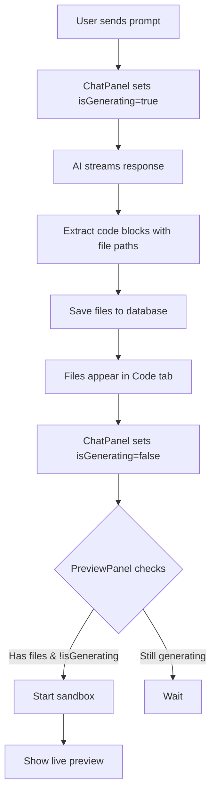

# AI Environment Awareness Implementation

## Overview

Implemented a comprehensive system where the AI model is fully aware of its sandbox environment, available tools, and file structure. The sandbox now starts **only after** the AI has completed generating the initial application files, showing live file generation in the meantime.

## Key Features

### 1. **Environment-Aware System Prompts**

The AI now knows exactly what environment it's working in:

**File**: `src/lib/ai/system-prompts.ts`

```typescript
export const SANDBOX_ENV: SandboxEnvironment = {
  type: "e2b",
  runtime: "nodejs",
  framework: "nextjs",
  version: "15.1.3",
  workingDir: "/home/user",
  port: 3000,
  features: [
    "Hot Module Replacement (HMR)",
    "Automatic file watching",
    // ... more features
  ],
};
```

**Benefits:**

- AI understands the exact sandbox configuration
- Generates code appropriate for E2B environment
- Uses correct file paths relative to `/home/user`
- Knows about HMR and auto-reload capabilities

### 2. **Tool Awareness**

The AI is informed about available tools and how to use them:

````typescript
export const AVAILABLE_TOOLS = [
  {
    name: "File Creation",
    description: "Create new files with code blocks using file path comments",
    syntax: "```typescript // path/to/file.tsx\n// code here\n```",
  },
  {
    name: "Live Preview",
    description: "E2B sandbox automatically previews changes in real-time",
    behavior: "Next.js dev server runs on port 3000 with HMR enabled",
  },
  // ... more tools
];
````

**Benefits:**

- AI knows how to format code for file creation
- Understands live preview capabilities
- Doesn't tell users to manually restart servers
- Leverages HMR effectively

### 3. **Delayed Sandbox Start**

The sandbox now waits for AI to finish generating files before starting.

**Flow:**

```
1. User creates project → Template files generated
2. User sends first prompt → AI starts generating files
3. Files appear in Code tab in real-time (live generation)
4. AI completes generation → Sandbox automatically starts
5. Preview becomes available with generated code
```

**Implementation:**

**PreviewPanel** (`src/components/coding-interface/PreviewPanel.tsx`):

```typescript
interface PreviewPanelProps {
  isGeneratingFiles?: boolean; // NEW: Track AI generation status
}

// Only auto-start if AI is NOT generating
const shouldAutoStart =
  sandboxStatus === "inactive" &&
  Object.keys(projectFiles).length > 0 &&
  !isGeneratingFiles; // ✅ Wait for AI to finish
```

**ChatPanel** (`src/components/coding-interface/ChatPanel.tsx`):

```typescript
const handleSendMessage = async () => {
  // Notify parent that we're generating files
  onGeneratingStatusChange?.(true);

  try {
    // ... AI generation ...

    const extractedFiles = extractCodeBlocks(fullContent);
    if (extractedFiles.length > 0) {
      await saveFiles(extractedFiles);
    }
  } finally {
    // Notify parent that generation is complete
    onGeneratingStatusChange?.(false); // ✅ Triggers sandbox start
  }
};
```

### 4. **No Hardcoded Templates in Sandbox**

The sandbox API no longer falls back to hardcoded templates.

**Before:**

```typescript
// ❌ Old approach
const projectFiles = files || getDefaultNextJsFiles();
```

**After:**

```typescript
// ✅ New approach
const projectFiles = files && Object.keys(files).length > 0 ? files : {};

if (Object.keys(projectFiles).length === 0) {
  return NextResponse.json(
    {
      error:
        "No project files available. Please generate files first using the AI chat.",
    },
    { status: 400 }
  );
}
```

**Benefits:**

- Forces users to use AI for file generation
- No outdated fallback templates
- AI has full control over initial structure
- More flexible project types

### 5. **Enhanced System Prompts**

Three specialized system prompts based on task type:

#### Coding Prompt

- Environment details (E2B, Node.js, Next.js 15)
- File structure conventions
- Design system rules (neutral colors, rounded corners)
- Tool usage examples
- Best practices

#### Naming Prompt

- Project naming guidelines
- Format conventions (lowercase, hyphens)
- Example good/bad names

#### General Prompt

- Platform capabilities
- Feature explanations
- Troubleshooting help

## File Changes

### New Files

1. **`src/lib/ai/system-prompts.ts`**
   - Environment configuration
   - Tool definitions
   - System prompt generators
   - Complete sandbox awareness

### Modified Files

1. **`src/app/api/chat/route.ts`**

   - Uses new system prompt system
   - Imports from `system-prompts.ts`
   - Environment-aware AI responses

2. **`src/components/coding-interface/PreviewPanel.tsx`**

   - New `isGeneratingFiles` prop
   - Waits for AI to complete before starting sandbox
   - Enhanced logging for debugging

3. **`src/components/coding-interface/ChatPanel.tsx`**

   - New `onGeneratingStatusChange` callback
   - Notifies parent when generation starts/completes
   - Triggers sandbox start after files are ready

4. **`src/components/CodingInterface.tsx`**

   - Tracks `isGeneratingFiles` state
   - Passes callbacks between ChatPanel and PreviewPanel
   - Coordinates file generation workflow

5. **`src/app/api/sandbox/[projectId]/route.ts`**
   - Removed hardcoded template fallback
   - Returns error if no files available
   - Forces AI-driven file generation

## User Experience Improvements

### Before

1. User creates project → Hardcoded template loaded
2. Sandbox starts immediately
3. AI generates files → Updates existing sandbox
4. User sees template first, then AI changes

### After

1. User creates project → Template in database only
2. User describes app → AI generates files
3. **Files appear in Code tab in real-time** ✨
4. AI completes → Sandbox starts automatically
5. User sees **only AI-generated code** from the start

## AI Understanding

The AI now knows:

### Environment

- Running in E2B Code Interpreter sandbox
- Working directory: `/home/user`
- Port: `3000` for Next.js dev server
- HMR enabled for instant updates

### File System

```
/home/user/
├── src/
│   ├── app/              # App Router pages & layouts
│   ├── components/       # React components
│   ├── lib/              # Utilities & helpers
│   └── styles/           # Global styles
├── public/               # Static assets
├── package.json
├── tsconfig.json
├── tailwind.config.ts
└── next.config.ts
```

### Capabilities

- File creation via code blocks with path comments
- Automatic preview updates (no manual restarts)
- TypeScript support
- Tailwind CSS with design system constraints
- Prisma database access

### Limitations

- Must use neutral colors only
- Must use rounded corners on interactive elements
- Must support dark mode
- Must follow Next.js conventions

## Example AI Interaction

**User:** "Create a dashboard with a sidebar and header"

**AI Response:**

````
I'll create a professional dashboard layout with a sidebar and header. Here are the components:

```typescript // src/components/DashboardLayout.tsx
export default function DashboardLayout({ children }: { children: React.ReactNode }) {
  return (
    <div className="flex h-screen bg-neutral-100 dark:bg-neutral-900">
      {/* Sidebar */}
      <aside className="w-64 bg-neutral-900 dark:bg-neutral-800 rounded-2xl m-2">
        {/* ... */}
      </aside>

      {/* Main Content */}
      <main className="flex-1 flex flex-col overflow-hidden">
        {/* ... */}
      </main>
    </div>
  );
}
````

This layout uses neutral colors and rounded corners as per the design system...

````

**What Happens:**
1. Code block extracted automatically
2. File created at `src/components/DashboardLayout.tsx`
3. File appears in Code tab immediately
4. After AI completes, sandbox starts
5. Preview shows the dashboard (HMR makes it instant)

## Benefits

### For Users
- ✅ Faster initial app generation (no template editing)
- ✅ See files being created in real-time
- ✅ Sandbox only starts when ready
- ✅ No wasted resources on empty templates
- ✅ AI has full creative freedom

### For Developers
- ✅ No hardcoded templates to maintain
- ✅ AI understands exact environment
- ✅ Better code generation quality
- ✅ Easier to add new features
- ✅ More predictable behavior

### For AI
- ✅ Complete environment awareness
- ✅ Knows available tools
- ✅ Understands file paths
- ✅ Aware of capabilities and limitations
- ✅ Can explain features accurately

## Technical Details

### Environment Detection
The AI receives this information in every coding request:

```typescript
const systemPrompt = `
You are working in an E2B Code Interpreter sandbox:
- Working Directory: /home/user
- Runtime: Node.js with Next.js dev server
- Port: 3000
- Hot Reload: ✅ Enabled
- File System: Full Linux filesystem access
- Network: Outbound internet access available
...
`;
````

### File Generation Flow



### State Management

**CodingInterface** (Parent):

```typescript
const [isGeneratingFiles, setIsGeneratingFiles] = useState(false);
```

**ChatPanel** (Child):

```typescript
onGeneratingStatusChange?.(true); // Starting generation
onGeneratingStatusChange?.(false); // Completed
```

**PreviewPanel** (Child):

```typescript
if (!isGeneratingFiles && hasFiles && sandboxInactive) {
  startSandbox(); // ✅ Safe to start
}
```

## Testing

### Test Scenario 1: New Project

1. Create project with description
2. Verify AI generates initial files
3. Check files appear in Code tab
4. Confirm sandbox starts after generation
5. Verify preview shows AI-generated code

### Test Scenario 2: No Initial Description

1. Create project without description
2. Send first prompt via chat
3. Watch files being created
4. Confirm sandbox waits for completion
5. Verify preview appears after generation

### Test Scenario 3: Multiple File Updates

1. AI generates initial files
2. Sandbox starts automatically
3. Request additional features
4. Verify HMR updates preview
5. Confirm no sandbox restart needed

## Future Enhancements

1. **Progress Indicators**

   - Show file generation progress
   - Display which files are being created
   - Estimate time remaining

2. **Template Marketplace**

   - Let AI choose from multiple templates
   - Community-contributed templates
   - Framework-specific templates (not just Next.js)

3. **Environment Customization**

   - User-selectable Node.js versions
   - Custom environment variables
   - Additional tools and libraries

4. **Smart Caching**
   - Cache npm installations
   - Reuse sandboxes for similar projects
   - Faster subsequent starts

## Conclusion

The AI is now fully aware of its environment and tools, generating better code with proper context. The sandbox start delay ensures users see live file generation and prevents wasted resources. The removal of hardcoded templates gives AI complete creative freedom while maintaining professional standards through the design system.
